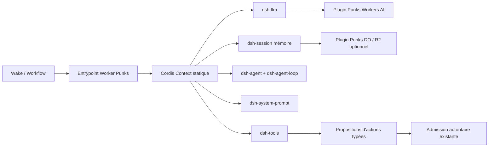

# DeepSeek Harness pour Buzz/Punks : architecture, coûts et scalabilité

Date de recherche : 2026-08-22

## Question

Évaluer l'intérêt de remplacer ou de restructurer `buzz-acp` et/ou le Bot
Runtime Cloudflare de Punks à partir de DeepSeek Harness (DSH), dont
l'architecture repose sur des plugins Cordis.

## Conclusion exécutive

Le profil produit DSH livré (`base` + `headless`) ne s'exécute pas sans
modification dans un isolate Cloudflare Worker. En revanche, le contre-audit
détaillé plus bas corrige une formulation trop pessimiste de la première
analyse : **Cordis et le spine agent DSH minimal ont été réellement bundlés et
exécutés sous `workerd`**, à condition de les composer par imports statiques et
de remplacer les plugins d'effets locaux. Un tour complet avec session et
adaptateur modèle déterministe a réussi après un seul petit correctif de build
dans `dsh-llm`. Le DSH complet est par ailleurs techniquement hébergeable sur
Cloudflare Containers ou Sandbox SDK ; c'est l'ADR Punks 0001 actuel, et non
Cloudflare, qui exclut cette variante. Le bon choix est donc double :

1. utiliser DSH comme runtime ACP optionnel derrière `buzz-acp` pour les usages
   locaux/Desktop, après un test de compatibilité ;
2. poursuivre l'adoption réelle des packages Cordis/DSH purs dans un petit noyau
   Workers, avec un adaptateur Workers AI, une persistance conforme aux ADR et
   des plugins statiques, versionnés et publiés par Punks ; ne réimplémenter ces
   interfaces qu'en cas d'échec mesuré de l'intégration complète.

La chaîne autoritaire Punks doit rester non pluggable : `ConversationDO`,
`BotInstallationDO`, Wake opaque, Queue, Workflow, credential court, Admission
et receipt terminal. Les plugins ne doivent produire que des propositions
d'action typées ; ils ne doivent jamais posséder l'autorité d'exécution.

À sémantique identique, aucune économie Cloudflare automatique ni aucun gain de
latence n'est encore démontré. La valeur principale de DSH est bien réelle mais
se situe d'abord dans le code et la vitesse d'évolution du produit : ajout de
modèles, de contexte, de politiques et d'actions sans modifier la boucle
centrale. Une boucle agent généraliste DSH peut en revanche augmenter fortement
les tokens, les appels modèle, les étapes durables et la latence.

## Deux surfaces différentes

### `buzz-acp`

`buzz-acp` est un pont local/natif. Il gère l'authentification au relay, les
subscriptions, la mise en file par canal, la supervision de processus et le
protocole ACP sur stdio. Il sait déjà lancer n'importe quel agent ACP et accepte
des définitions BYOH.

DSH fournit un serveur ACP d'automatisation. Il est donc naturellement un agent
que `buzz-acp` peut lancer, pas un remplacement de la partie Buzz du pont.

Limites actuelles de `@deepseek-ai/dsh-acp` à valider pendant le spike :

- sessions neuves seulement ; pas de load/list/resume/delete/fork ;
- refus des `mcpServers` et `additionalDirectories` non vides ;
- réponses ACP émises après commit, sans streaming token par token ;
- pas de reasoning, plans, tool activity, titres ou usage sur le fil ACP ;
- durée de vie des sessions attachée à la connexion.

### Bot Runtime Cloudflare

Le Bot Runtime Punks est une exécution durable et bornée par Wake. Le chemin
actuel contient trois étapes Workflow pour un `skip` et quatre pour une réaction :

1. claim du Wake ;
2. lecture sensible du contexte et décision modèle ;
3. exécution de la réaction si nécessaire ;
4. completion avec receipt terminal.

Le release courant fixe Qwen 3 30B A3B FP8, 8 192 octets de contenu, 32 tokens
de sortie, température zéro, un timeout de 20 secondes et la seule décision
`skip | react`.

Le fichier `cloudflare/staging.resources.json` indique encore
`configured-not-deployed` pour le Bot Runtime et le Workflow, ainsi que
`remoteAiInference.executed: false`. Il n'existe donc pas encore de mesures
réelles de production à comparer.

## Ce que DSH apporte réellement

L'architecture DSH place dans un contexte Cordis partagé des services, des
événements typés et des effets réversibles. Le modèle, le registre d'outils, le
journal de session et la boucle agent sont eux-mêmes des plugins. Les profiles
et bundles composent un arbre de plugins au démarrage.

Gains attendus pour le code Punks :

- un manifeste de release décrit la composition exacte d'un Bot ;
- chaque adaptateur modèle, assembleur de contexte, parseur de décision et
  observateur est testable isolément ;
- l'ajout d'un second fournisseur ou d'une seconde politique ne duplique pas la
  boucle durable ;
- le rollback revient à repointer un release immuable ;
- les outils non utilisés peuvent être absents du prompt et de l'exécution.

Ce ne sont pas des gains automatiques de taille. Dans le checkout étudié au
commit `b150a551b8d465e31e418e1b2eaf5e79bbb7d28e`, DSH contient 227 répertoires de
packages ; son bundle de base a 78 lignes de composition de plugins et 77
dépendances directes. Par comparaison, les fichiers de production sélectionnés
qui matérialisent le chemin Bot Punks actuel totalisent environ 3 007 lignes
TypeScript, et le seul Worker `bot-runtime/src` environ 1 017 lignes.

`buzz-acp` totalise environ 43 895 lignes dans 13 fichiers Rust, tests inline
compris, mais DSH n'en remplace pas les responsabilités Buzz. Une intégration
locale ne permet donc pas de soustraire ces lignes mécaniquement.

## Compatibilité Cloudflare Workers

Le DSH complet n'est pas déployable tel quel dans un isolate Worker. Plusieurs
packages utilisés par ses compositions reposent sur `node:child_process`,
`node:worker_threads`, `node:vm`, `node:sqlite` et des watchers de fichiers.
Cloudflare classe les quatre premiers parmi ses modules stubs non fonctionnels ;
`fs.watch` et `fs.watchFile` ne sont pas supportés.

Les limites actuelles Workers sont également structurantes :

- 128 MB de mémoire par isolate ;
- bundle Paid de 10 MB gzip / 64 MB non compressé ;
- une seconde maximum pour l'initialisation globale ;
- 30 secondes de CPU par défaut, configurables jusqu'à cinq minutes.

Un sous-ensemble Cordis/DSH soigneusement sélectionné est effectivement
bundleable et exécutable : le spike local documenté plus bas a monté les vrais
packages amont et exécuté un tour complet dans `workerd`. Il faut toujours
remplacer la découverte dynamique, les effets filesystem durables, les
subprocess et les worker threads, mais il s'agit bien d'une **adoption des
packages amont** Cordis et DSH plutôt que d'une réécriture de leur idée. DSH ne
publie toutefois encore ni artefact Wrangler, ni matrice de compatibilité
Cloudflare, ni adaptateur Workers AI.

Exécuter DSH dans un processus Node ou un Container déplacerait ce compute hors
de l'isolate Workers. Un Container Cloudflare reste sur la plateforme
Cloudflare, mais cette option est contraire à l'ADR Punks 0001, qui impose les
services Workers gérés et interdit Containers et les serveurs historiques.

## Contre-audit : ce qui peut réellement tourner sur Cloudflare

### Verdict corrigé

Le contre-audit infirme la version forte de la conclusion précédente : **DSH
n'est pas indivisible**. Il faut distinguer quatre couches :

1. le noyau Cordis (contexte, injection, lifecycle, événements, services) ;
2. le spine agent DSH (LLM, Session, Agent, prompt, outils, boucle) ;
3. le chargeur de profils DSH (YAML, résolution Node, HMR, CLI) ;
4. les plugins d'effets locaux (shell, subprocess, filesystem durable, SQLite
   Node, worker threads, PTY).

Les couches 1 et une grande partie de la couche 2 ont été bundleées et exécutées
dans `workerd`. Les couches 3 et 4 ne le sont pas telles quelles.
Cela ouvre une troisième option réelle entre « tout DSH » et « seulement copier
l'idée » : **embarquer les packages Cordis/DSH amont comme bibliothèque et les
composer statiquement dans le Bot Runtime**.

Le dépôt DSH ne publie ni bundle Wrangler, ni matrice `workerd`, ni test
Cloudflare. Une preuve locale a donc été réalisée contre le
checkout amont au commit `b150a551b8d465e31e418e1b2eaf5e79bbb7d28e`, avec
Wrangler `4.124.0`, la date de compatibilité `2026-08-22` et `nodejs_compat` :

- imports statiques du vrai Cordis et de `dsh-agent`, `dsh-agent-loop`,
  `dsh-llm`, `dsh-scope`, `dsh-session`, `dsh-system-prompt` et `dsh-tools` ;
- bundle `wrangler deploy --dry-run` de **692,37 Kio brut / 169,23 Kio gzip**,
  très inférieur aux limites Paid de 64 Mio / 10 Mio ;
- montage effectif sous `workerd` des services `agents`, `agentLoop`, `llm`,
  `sessions`, `systemPrompt` et `tools` ;
- exécution d'un tour complet avec adaptateur LLM déterministe : réponse
  `hello from DSH on workerd`, **15 événements de session**, HTTP 200 ;
- teardown du contexte réussi sous le même runtime ;
- temps observé de 22 ms pour la requête locale réussie, donné seulement comme
  smoke test et **pas** comme benchmark de performance.

Le code amont non modifié échouait d'abord au démarrage sur la lecture de sa
propre version par `createRequire(import.meta.url)('../package.json')`. Le seul
correctif du spike DSH minimal a été d'injecter `0.1.1-rc.2` au build dans ce
joint d'attribution. Aucun appel Workers AI distant et aucun déploiement
Cloudflare n'ont été effectués : il reste à tester le vrai binding AI, les
budgets, la mémoire, les cold starts et la persistance dans l'architecture
Punks.

Le contraste avec le boot standard est instructif : `dsh-app-boot` se bundle
aussi en dry-run (**215,71 Kio brut / 48,73 Kio gzip**), mais son démarrage
`workerd` non modifié retourne HTTP 500 dans le Loader Cordis, qui appelle lui
aussi `createRequire(import.meta.url)` puis dépend d'une résolution dynamique de
plugins. Le dry-run seul ne prouve donc pas la compatibilité d'un profil. Même
après correction de ce premier appel, le YAML/Loader et les plugins locaux du
profil `base/headless` exigeraient les adaptations décrites plus bas.

### Le noyau réellement portable

Le noyau `@deepseek-ai/cordis` n'a aucune dépendance Node obligatoire : son
manifest n'a que `@deepseek-ai/cosmokit` et `@standard-schema/spec` en
dépendances, tandis que Loader et Include sont des peers **optionnels**. Son
répertoire `src` n'importe aucun module `node:*`. L'API officielle montre aussi
qu'un arbre peut être composé directement avec `new Context()` et
`ctx.plugin(...)`, sans YAML ni Loader. C'est donc le meilleur candidat du
contre-audit, et il s'agit bien du vrai Cordis, pas d'une imitation
([manifest Cordis](https://github.com/deepseek-ai/deepseek-harness/blob/b150a551b8d465e31e418e1b2eaf5e79bbb7d28e/vendor/cordis/package.json),
[composition statique](https://github.com/deepseek-ai/deepseek-harness/blob/b150a551b8d465e31e418e1b2eaf5e79bbb7d28e/vendor/cordis/README.md)).

Le plus petit spine DSH utile pour Punks peut rester amont :

| Package | Rôle dans le Worker | Import Node observé | État `workerd` |
|---|---|---|---|
| `@deepseek-ai/cordis`, `cosmokit`, `schemastery` | DI, lifecycle, événements et schémas | aucun dans leurs `src` | candidat direct |
| `dsh-invariants`, `dsh-brand`, `dsh-scope`, `dsh-timeout`, `dsh-typert-protocol`, `dsh-settings` | primitives et interfaces transverses | aucun dans leurs `src` | candidat direct |
| `dsh-system-prompt`, `dsh-tools` | assemblage du prompt et pipeline d'outils, même avec zéro outil | aucun dans leurs `src` | candidat direct |
| `dsh-session` | journal événementiel en mémoire ; la persistance est volontairement un plugin séparé | `node:path.isAbsolute` | API Path supportée |
| `dsh-agent-loop` | boucle concrète et création d'identités | `node:crypto.randomUUID` | API Crypto supportée |
| `dsh-attachment` | contrat des pièces jointes | `node:buffer` | Buffer supporté |
| `dsh-agent` | registre et portée causale des agents | `node:async_hooks.AsyncLocalStorage`, `node:util/types` | tour et teardown réussis dans le smoke `workerd` ; garder un test de régression |
| `dsh-llm` | contrat fournisseur, messages et erreurs | `node:module.createRequire` pour lire sa propre version | fonctionne après injection d'une constante au build |

Les statuts Cloudflare ne sont pas des suppositions générales : la
documentation actuelle classe Async Context, Buffer, Crypto, Path et Utilities
comme APIs natives supportées. `node:module` n'est que partiellement supporté
([compatibilité Node](https://developers.cloudflare.com/workers/runtime-apis/nodejs/)).
Le Bot Runtime Punks utilise déjà une date de compatibilité `2026-08-21` avec
`nodejs_compat`, donc ces APIs natives ne demandent pas de changement de runtime
dans le déploiement actuel (`cloudflare/workers/bot-runtime/wrangler.jsonc`).

Il existe une divergence documentaire à garder sous test. Le plugin `dsh-agent`
utilise `AsyncLocalStorage.run()` et `getStore()`, tous deux supportés, mais
appelle aussi `disable()` pendant son arrêt. La documentation Cloudflare indique
que `disable()` et `enterWith()` sont omis. Pourtant, le `workerd` livré avec
Wrangler `4.124.0` exposeait `disable()` comme fonction et le teardown DSH a
réussi. Aucun patch `dsh-agent` n'a donc été nécessaire dans ce smoke, mais un
test de régression reste indispensable et un teardown conditionnel serait un
durcissement prudent
([code DSH Agent](https://github.com/deepseek-ai/deepseek-harness/blob/b150a551b8d465e31e418e1b2eaf5e79bbb7d28e/packages/core/agent/src/index.ts),
[AsyncLocalStorage Workers](https://developers.cloudflare.com/workers/runtime-apis/nodejs/asynclocalstorage/)).

Le joint réellement bloquant du smoke est petit : `dsh-llm` utilise `createRequire()`
uniquement afin de lire la version de son `package.json` pour le `User-Agent`.
L'injection d'une constante de version a suffi. Un alias de build ou un import
JSON statique éviterait également de maintenir cette valeur à la main
([source d'attribution DSH](https://github.com/deepseek-ai/deepseek-harness/blob/b150a551b8d465e31e418e1b2eaf5e79bbb7d28e/packages/llm/llm/src/attribution.ts)).

Une composition Worker crédible serait donc :

Le modèle serait un petit plugin DSH qui appelle le binding Workers AI déjà
présent ; DSH n'a actuellement aucun adaptateur Cloudflare. Pour un tour Wake
sans reprise, `dsh-session` peut rester strictement en mémoire. Pour des sessions
reprises, son interface de persistance est déjà séparée du store : un backend
Punks peut écrire dans le SQLite du Durable Object ou R2 sans conserver le
backend JSONL local. Cela ne résout pas la règle produit de non-persistance du
plaintext : le backend Punks doit continuer à ne persister que ce que les ADR
autorisent.

### `base` et `headless` : dépendances nécessaires ou plugins excluables ?

Réponse courte : **les dépendances sont nécessaires au profil livré, mais pas au
framework DSH**.

Le bundle `dsh-base` insère explicitement 78 lignes de plugins. Parmi elles se
trouvent HMR, settings et credentials fichiers, JSONL, subprocess, sandboxes
shell, outils filesystem, workflow worker-thread et spill local. Le bundle
`dsh-headless` désactive HMR, mais ajoute justement
`dsh-code-runtime-worker-thread`, puis un runner lié à `process.stdout`,
`process.stderr`, `process.cwd()` et à la sortie du processus
([patch base](https://github.com/deepseek-ai/deepseek-harness/blob/b150a551b8d465e31e418e1b2eaf5e79bbb7d28e/packages/bundle/base/cordis.patch.yml),
[patch headless](https://github.com/deepseek-ai/deepseek-harness/blob/b150a551b8d465e31e418e1b2eaf5e79bbb7d28e/packages/bundle/headless/cordis.patch.yml),
[runner headless](https://github.com/deepseek-ai/deepseek-harness/blob/b150a551b8d465e31e418e1b2eaf5e79bbb7d28e/packages/bundle/headless/src/index.ts)).

Cependant, Cordis n'initialise pas une entrée marquée `disabled`, et les couches
de profil ultérieures gagnent par identifiant. Il est donc techniquement
possible de désactiver des lignes du bundle livré avant leur activation
([garde `disabled`](https://github.com/deepseek-ai/deepseek-harness/blob/b150a551b8d465e31e418e1b2eaf5e79bbb7d28e/vendor/loader/src/config/entry.ts),
[ordre des couches](https://github.com/deepseek-ai/deepseek-harness/blob/b150a551b8d465e31e418e1b2eaf5e79bbb7d28e/docs/user/develop/basic/publish.md)).
Dans un Worker, il reste préférable de ne pas embarquer le profil et son Loader
Node du tout : des imports statiques permettent au bundler d'éliminer les
packages exclus, évitent la résolution de modules depuis un répertoire de profil
et réduisent la surface face aux limites de taille et de démarrage.

Voici le tri exact des principaux joints :

| Lignes du profil amont | Pourquoi elles ne passent pas telles quelles | Traitement Worker |
|---|---|---|
| `hmr` | Chokidar repose sur les watchers ; Workers supporte désormais un VFS, mais pas `fs.watch`/`fs.watchFile` | exclure ; releases immuables |
| `settings`, `credentials` | les deux plugins fichier activent Chokidar par défaut | exclure ; bindings/secrets/config Punks, ou configurer `watch: false` seulement pour un test |
| `session-persistence-jsonl`, `attachment-local`, `spill-local` | `/tmp` est en mémoire, propre à une requête et non persistant | remplacer par mémoire, DO/R2 selon la politique de données |
| `session-query-sqlite` | `node:sqlite` est un stub non fonctionnel | garder au plus `openAt: never` (l'import est différé), ou remplacer par DO SQLite/D1 |
| `subprocess`, `sandbox`, `bash-sandbox`, `pwsh-sandbox`, `tool-bash`, `tool-pwsh`, `jobs` | `child_process` est un stub ; `node-pty`/`koffi` sont natifs | exclure ; traduire en actions Punks ou déléguer à Container/Sandbox |
| `workflow-worker-thread` | `node:worker_threads` est un stub | exclure ; utiliser Workflow Cloudflare ou Dynamic Workflow |
| `code-runtime` de `headless` | même dépendance à `worker_threads` | exclure ; Dynamic Worker Loader pour du JS isolé si le besoin existe |
| `headless-startup`, `headless-runner` | sémantique CLI/processus, pas handler Worker | remplacer par l'entrée Queue/Workflow/DO |
| `llm-deepseek` | `fetch` est portable, mais l'index des fichiers utilise le filesystem local et le plugin attend les coutures credentials/settings DSH | préférer un adaptateur Workers AI Punks ; tester séparément le mode texte DeepSeek direct |

Les sources Cloudflare actuelles affinent un point important du premier audit :
`node:fs` n'est plus entièrement absent. Workers possède un VFS avec `/bundle`
en lecture et `/tmp` en écriture. Mais `/tmp` est unique à la requête, toute
opération est exécutée synchroniquement, les octets comptent dans les 128 MB et
les watchers restent non supportés. Cela rend certains plugins fichier
**exécutables pendant un tour**, pas durables ni adaptés au profil DSH
([VFS Workers](https://developers.cloudflare.com/workers/runtime-apis/nodejs/fs/)).

À l'inverse, `node:child_process`, `node:worker_threads`, `node:sqlite`, `node:vm`
et `node:tty` restent documentés comme **stubs non fonctionnels** : les imports
peuvent réussir, mais l'appel réel échoue. Le fait qu'une installation ou un
bundle passe n'est donc pas une preuve d'exécution
([table des stubs](https://developers.cloudflare.com/workers/runtime-apis/nodejs/#non-functional-stub-modules)).

### « Cloudflare Workers » n'est pas « toute la plateforme Cloudflare »

La distinction change matériellement la réponse :

- **Cloudflare Worker / `workerd`** : isolate V8, APIs Web et sous-ensemble Node,
  128 MB, bundle Paid de 10 MB gzip / 64 MB brut, initialisation globale sous une
  seconde et CPU configurable jusqu'à cinq minutes. Il ne fournit ni processus
  Linux enfant ni thread Node. C'est la frontière actuelle de l'ADR 0001
  ([limites Workers](https://developers.cloudflare.com/workers/platform/limits/)).
- **Plateforme Cloudflare** : ensemble plus large qui inclut Workers, Durable
  Objects, Queues, Workflows, R2/D1, mais aussi Containers, Sandbox SDK, Dynamic
  Workers et Workers for Platforms. Une solution peut donc être « hébergée chez
  Cloudflare » sans s'exécuter dans `workerd`.

L'ADR 0001 de Punks définit volontairement « Cloudflare Native » plus étroitement
que la plateforme commerciale : services Workers gérés oui, Containers non.
Dire que le DSH complet est possible *sur Cloudflare* est donc vrai ; dire qu'il
respecte l'architecture Punks actuelle est faux tant que cet ADR n'est pas
renversé.

### Options d'hébergement réelles

| Option | Ce qu'elle peut héberger | Ce qu'elle ne change pas | Coût/limites structurantes | Pertinence Punks |
|---|---|---|---|---|
| Worker standard | Cordis + spine DSH statique + adaptateurs Punks | aucun shell/process/thread Node | limites Worker ci-dessus ; coût Worker standard | meilleure option pour le Bot Runtime borné |
| Dynamic Worker Loader | plugin ou composition JS pure chargée à la demande, avec bindings et limites par instance | reste un isolate Worker ; aucun `child_process`/`worker_threads` réel | Workers Paid seulement ; 1 000 créations uniques incluses/mois, puis 0,002 USD par Worker/jour, plus requêtes et CPU standard | utile pour isoler du code JS généré ou des variantes nombreuses, inutile pour quelques releases Punks fixes |
| Workers for Platforms | un Worker isolé déployé par tenant/plugin dans un dispatch namespace | même runtime Worker ; ne fait pas tourner le profil Node complet | 25 USD/mois, 20 M requêtes, 60 M CPU-ms et 1 000 scripts inclus ; CPU 30 s/invocation | pertinent seulement si Punks devient une plateforme de code multi-tenant |
| Containers | image Linux/AMD64 choisie par Punks, donc Node 24, subprocess, worker threads, PTY et dépendances natives DSH | disque local éphémère ; routage et scaling des instances à concevoir | cold start souvent 1–3 s ; six tailles de 256 MiB/1⁄16 vCPU à 12 GiB/4 vCPU ; facturation CPU/mémoire/disque + Worker + DO | seul candidat direct au DSH complet, à smoke-tester ; contredit ADR 0001 et alourdit le bot `react/skip` |
| Sandbox SDK | DSH potentiellement lancé dans un Linux/Node isolé, avec commandes, fichiers, processus et watch ; identité durable via DO | c'est une couche sur Containers, pas une alternative sans container | mêmes caractéristiques/prix Containers ; 50 subrequests Free ou 1 000 Paid en HTTP, un seul avec transport RPC | meilleur choix Cloudflare si l'objectif devient un coding agent qui exécute du code non fiable |

Dynamic Workers mérite une précision. L'API `load()` crée un isolate frais ;
`get(id, callback)` peut réutiliser un isolate avec un identifiant stable. Le
code TypeScript et ses dépendances npm doivent être transpilés/bundlés avant
chargement. On pourrait donc compiler une composition Cordis par release et
l'isoler, ou remplacer Code Mode/`worker_threads` par un Dynamic Worker. On ne
peut pas y lancer la CLI DSH, un shell ou `node-pty`
([API Worker Loader](https://developers.cloudflare.com/dynamic-workers/api-reference/),
[limites personnalisées](https://developers.cloudflare.com/dynamic-workers/usage/limits/),
[tarifs](https://developers.cloudflare.com/dynamic-workers/pricing/)). Les
Dynamic Workflows peuvent en plus reprendre un même Worker dynamique entre les
étapes durables ; c'est une alternative Cloudflare au plugin orchestration
worker-thread, pas une compatibilité binaire avec lui
([Dynamic Workflows](https://developers.cloudflare.com/dynamic-workers/usage/dynamic-workflows/)).

Workers for Platforms vise un autre problème : déployer le code de clients dans
un dispatch namespace, puis le router par un dispatch Worker. Les user Workers
restent des isolates et conservent leurs restrictions. Avec l'ADR 0028 — seuls
des Bots publiés et opérés par Punks — le service n'apporte rien à la première
livraison, sauf si le catalogue atteint des milliers de bundles indépendants
([fonctionnement](https://developers.cloudflare.com/cloudflare-for-platforms/workers-for-platforms/how-workers-for-platforms-works/),
[tarifs](https://developers.cloudflare.com/cloudflare-for-platforms/workers-for-platforms/reference/pricing/)).

Pour le DSH complet, Containers est la réponse technique directe. DSH exige
Node `^22.19 || >=24`, et Containers accepte une image Linux/AMD64 choisie par
Punks : une image Node 24 peut donc conserver le profil `base/headless`, ses
processus et ses threads. Il reste à smoke-tester `node-pty`, `koffi` et le
sandbox interne DSH dans le noyau de la VM ; ce point n'est pas démontré par les
deux projets ([engine DSH](https://github.com/deepseek-ai/deepseek-harness/blob/b150a551b8d465e31e418e1b2eaf5e79bbb7d28e/package.json)).
Cloudflare route chaque instance par un Durable Object. Le cold
start annoncé est souvent de 1 à 3 secondes ; le disque est recréé après un
sleep, avec persistance possible via le storage du DO ou R2/FUSE. Le scaling est
encore explicite : identifiants d'instances ou nombre fixe avec `getRandom` ; le
routage/autoscaling intégré est annoncé comme futur
([lifecycle Container](https://developers.cloudflare.com/containers/platform-details/architecture/),
[scaling](https://developers.cloudflare.com/containers/platform-details/scaling-and-routing/),
[limites](https://developers.cloudflare.com/containers/platform-details/limits/),
[tarifs](https://developers.cloudflare.com/containers/pricing/)).

Sandbox SDK est plus adapté si le besoin principal est l'exécution de code non
fiable : Worker client, DO d'identité/routage, puis VM Linux Container. Il inclut
Node, Git et des processus ; le transport RPC multiplexe les opérations sur une
connexion. Mais il hérite exactement du lifecycle, du placement, du scaling et
du coût Containers. Ce n'est donc pas une façon de respecter « Workers sans
Containers »
([architecture Sandbox](https://developers.cloudflare.com/sandbox/concepts/architecture/),
[limites Sandbox](https://developers.cloudflare.com/sandbox/platform/limits/),
[runtime Container](https://developers.cloudflare.com/sandbox/concepts/containers/)).

### Décision révisée et preuve à obtenir

Le premier smoke ayant passé, le meilleur ordre de suite n'est plus
« réimplémenter un mini-Cordis », mais :

1. conserver comme test de non-régression le bundle statique qui monte le vrai
   `@deepseek-ai/cordis` et le spine DSH ;
2. upstreamer ou isoler l'injection de version `dsh-llm`, et surveiller le
   teardown `AsyncLocalStorage` sans le déclarer bloquant tant que le smoke passe ;
3. fournir un adaptateur Workers AI et un entrypoint Wake Punks, sans Loader,
   YAML, HMR, CLI, JSONL, shell, SQLite Node ni worker thread ;
4. répéter le tour avec le vrai adaptateur Workers AI, puis mesurer startup,
   mémoire, CPU, p50/p95, tokens et erreurs sous la limite de 128 MB ;
5. ajouter un backend `SessionPersistence` DO/R2 seulement si la reprise est un
   besoin, en conservant la politique de non-persistance du plaintext ;
6. réserver Container/Sandbox au futur coding agent qui justifie réellement
   shell, PTY, workspace et code arbitraire.

Critères de go/no-go du spike Worker : bundle inférieur à 10 MB gzip et 64 MB
brut, startup inférieur à une seconde, teardown sans API Node omise, aucune
référence exécutable aux modules stubs, un seul appel modèle pour le vertical
`react/skip`, et parité des receipts/admission. Si ces critères passent, Punks
adopte réellement le spine DSH. S'ils échouent, le plan initial — petit kernel
Punks inspiré des interfaces DSH — redevient le fallback justifié par une mesure
et non par une supposition.

## Modèle de coût Cloudflare

Hypothèse illustrative : un million de tours réussis dans un mois, message Queue
inférieur à 64 KB, aucun retry, 2 048 tokens d'entrée utilisateur et 32 tokens de
sortie, hors petit prompt système.

### Runtime actuel avec Qwen

- Queue : trois opérations par message, donc trois millions d'opérations ; après
  le million inclus, environ **0,80 USD**.
- Workflow : trois millions d'étapes si tous les tours sont `skip`, ou quatre
  millions s'ils exécutent tous une réaction ; après 500 000 étapes incluses,
  environ **20 à 28 USD**.
- Workers AI Qwen 3 30B A3B FP8 : `0,051 USD/M` tokens d'entrée et
  `0,335 USD/M` tokens de sortie, soit environ **115,17 USD** pour l'hypothèse.
- Sous-total comparable : environ **135,97 à 143,97 USD** par million de tours.

Ce sous-total exclut le minimum Workers Paid de 5 USD, les Durable Objects, le
CPU Workers partagé, la rétention Workflow, les retries, le prompt système et
l'allocation AI gratuite de 10 000 neurons par jour. Ces postes exigent des
métriques de staging/production pour être attribués correctement.

### Effet de la modularisation

Si les événements de plugins restent en mémoire dans l'étape sensible existante
et si le nombre d'appels modèle reste égal à un, le coût est presque inchangé.

Une étape Workflow durable supplémentaire par tour coûte marginalement environ
**8 USD par million de tours**, une fois l'allocation consommée. Un second appel
Qwen de même taille ajoute environ **115 USD par million de tours** ; dans une
boucle réelle le contexte grandit, donc le coût peut être supérieur.

Le journal DSH complet ne doit pas être copié dans l'état Workflow par défaut :
il augmente la sérialisation et le stockage et peut conserver des données que le
design actuel évite explicitement de persister.

### DSH n'impose pas un modèle DeepSeek

DSH est model-agnostic. Conserver Qwen conserve donc le prix Qwen. À taille de
requête identique, les modèles DeepSeek Workers AI publiés le 18 août 2026 sont
plus chers :

| Modèle | Coût illustratif / 1 M tours | Multiple vs Qwen |
|---|---:|---:|
| Qwen 3 30B A3B FP8 actuel | 115,17 USD | 1,00x |
| DeepSeek v4 Flash 0731 | 943,36 USD | 8,19x |
| DeepSeek v4 Pro 0813 | 2 830,08 USD | 24,57x |

Calcul hors allocation gratuite, cached input et prompt système. Un agent DSH
généraliste produirait normalement plus de 32 tokens et pourrait appeler le
modèle plusieurs fois ; cette comparaison est donc favorable à DSH.

## Performance et scalabilité

Il n'existe aucun gain de performance publié à reprendre : `BENCHMARK.md` de
DSH ne contient qu'une instruction d'exécution, sans résultat.

Effets directionnels :

- la latence de dispatch de quelques plugins statiques sera faible face à
  l'inférence, mais doit être mesurée ;
- le démarrage d'un profil DSH complet, son graphe de plugins et son processus
  Node rendent le cold start vraisemblablement plus lourd ;
- l'ACP DSH retarde volontairement la sortie jusqu'au commit du message, ce qui
  dégrade le time-to-first-token par rapport à un flux de deltas ;
- une boucle avec plusieurs steps modèle/outils augmente la latence
  proportionnellement aux appels et dépendances externes ;
- un manifeste minimal peut réduire les schémas d'outils et les tokens de prompt,
  mais ce gain vient de la sélection des capacités, pas de Cordis lui-même.

La scalabilité Cloudflare actuelle est bonne : `BotInstallationDO` sérialise
l'autorité par installation, Queue absorbe les pointes et un Workflow isole
chaque Wake. Le noyau pluggable recommandé conserve exactement ce sharding.

Un DSH Node complet réintroduirait un processus à dimensionner, une stratégie de
placement des sessions, des limites mémoire et un stockage de session à opérer.
Ce n'est pas une amélioration de scalabilité pour Punks ; c'est un autre modèle
d'exploitation.

## Architecture recommandée

### Noyau non pluggable

- identité et grants ;
- budgets et révocation ;
- idempotence et ledger Wake/Turn ;
- déchiffrement borné du contexte ;
- secrets et credentials courts ;
- Admission d'action ;
- écriture ConversationDO et receipt terminal ;
- politique de non-persistance du plaintext.

### Contributions pluggables et statiques

- enrichisseurs/réducteurs de contexte ;
- sections de prompt ;
- adaptateurs modèle ;
- parseurs et validateurs de décision ;
- propositions d'actions typées ;
- observateurs et métriques expurgés.

Chaque composition doit être un release Punks immuable : identifiant, digest,
plugins autorisés, modèle exact, limites de tokens/steps, contrats d'action et
budgets. Aucun package npm ou code fourni par un Workspace ne doit être installé
dynamiquement côté serveur. C'est nécessaire pour respecter les ADR 0021 et
0028.

Il ne faut pas transformer chaque plugin en Worker ou en étape Workflow. Les
plugins ordinaires sont des modules en mémoire ; seuls les vrais joints
d'exécution, de sécurité, de retry ou de durabilité restent des services ou des
étapes Cloudflare.

## Plan de décision proposé

1. Créer une composition ACP DSH minimale et épinglée, puis la lancer derrière
   `buzz-acp` sans MCP non vide.
2. Tester `initialize`, `session/new`, `session/prompt`, cancel, crash/restart,
   ordre par canal et comportement multi-canal.
3. Mesurer cold start, RSS, p50/p95, délai avant première sortie, durée totale,
   appels modèle, tokens d'entrée/sortie et taux d'échec.
4. Extraire dans le Bot Runtime un petit `PunksHarnessKernel` statique, sans
   augmenter le nombre d'étapes Workflow du vertical reaction.
5. Ajouter une seconde composition réelle, canary et budgets stricts ; ne
   retirer du code historique qu'après parité démontrée.

## Sources primaires

- DeepSeek Harness : <https://github.com/deepseek-ai/deepseek-harness>
- Architecture DSH : <https://github.com/deepseek-ai/deepseek-harness/blob/b150a551b8d465e31e418e1b2eaf5e79bbb7d28e/docs/architecture.md>
- ACP DSH : <https://github.com/deepseek-ai/deepseek-harness/blob/b150a551b8d465e31e418e1b2eaf5e79bbb7d28e/packages/acp/acp/README.md>
- Benchmark DSH : <https://github.com/deepseek-ai/deepseek-harness/blob/b150a551b8d465e31e418e1b2eaf5e79bbb7d28e/BENCHMARK.md>
- Cordis statique : <https://github.com/deepseek-ai/deepseek-harness/blob/b150a551b8d465e31e418e1b2eaf5e79bbb7d28e/vendor/cordis/README.md>
- Composition DSH base : <https://github.com/deepseek-ai/deepseek-harness/blob/b150a551b8d465e31e418e1b2eaf5e79bbb7d28e/packages/bundle/base/cordis.patch.yml>
- Composition DSH headless : <https://github.com/deepseek-ai/deepseek-harness/blob/b150a551b8d465e31e418e1b2eaf5e79bbb7d28e/packages/bundle/headless/cordis.patch.yml>
- Limites Workers : <https://developers.cloudflare.com/workers/platform/limits/>
- Compatibilité Node Workers : <https://developers.cloudflare.com/workers/runtime-apis/nodejs/>
- Filesystem Workers : <https://developers.cloudflare.com/workers/runtime-apis/nodejs/fs/>
- AsyncLocalStorage Workers : <https://developers.cloudflare.com/workers/runtime-apis/nodejs/asynclocalstorage/>
- Dynamic Workers : <https://developers.cloudflare.com/dynamic-workers/>
- API Worker Loader : <https://developers.cloudflare.com/dynamic-workers/api-reference/>
- Prix Dynamic Workers : <https://developers.cloudflare.com/dynamic-workers/pricing/>
- Workers for Platforms : <https://developers.cloudflare.com/cloudflare-for-platforms/workers-for-platforms/how-workers-for-platforms-works/>
- Prix Workers for Platforms : <https://developers.cloudflare.com/cloudflare-for-platforms/workers-for-platforms/reference/pricing/>
- Architecture Containers : <https://developers.cloudflare.com/containers/platform-details/architecture/>
- Scaling Containers : <https://developers.cloudflare.com/containers/platform-details/scaling-and-routing/>
- Limites Containers : <https://developers.cloudflare.com/containers/platform-details/limits/>
- Prix Containers : <https://developers.cloudflare.com/containers/pricing/>
- Architecture Sandbox SDK : <https://developers.cloudflare.com/sandbox/concepts/architecture/>
- Limites Sandbox SDK : <https://developers.cloudflare.com/sandbox/platform/limits/>
- Prix Workers : <https://developers.cloudflare.com/workers/platform/pricing/>
- Prix Queues : <https://developers.cloudflare.com/queues/platform/pricing/>
- Prix Workflows : <https://developers.cloudflare.com/workflows/reference/pricing/>
- Prix Workers AI : <https://developers.cloudflare.com/workers-ai/platform/pricing/>
- Prix Durable Objects : <https://developers.cloudflare.com/durable-objects/platform/pricing/>

## Fichiers Punks consultés

- `crates/buzz-acp/README.md`
- `cloudflare/workers/bot-runtime/src/bot-wake-workflow.ts`
- `cloudflare/workers/bot-runtime/src/model-port.ts`
- `cloudflare/workers/bot-runtime/wrangler.jsonc`
- `cloudflare/packages/core/src/bot-runtime-release.ts`
- `cloudflare/staging.resources.json`
- `docs/adr/0001-runtime-workers-sans-containers.md`
- `docs/adr/0021-capacites-bot-refus-par-defaut.md`
- `docs/adr/0028-bots-publies-operes-par-punks.md`
- `docs/adr/0058-executer-un-tour-bot-par-wake-opaque.md`
